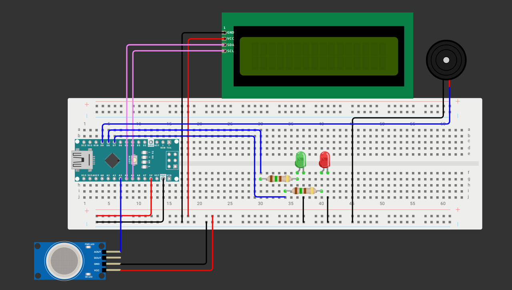

# Датчик газа на Arduino
Проект использует Arduino Nano для мониторинга уровня газа с помощью аналогового газового датчика. Система оснащена двухцветной светодиодной индикацией состояния: зелёный светодиод сигнализирует о штатном режиме работы, а красный — о срабатывании тревоги.

## Требуемые компоненты / Required components
- Arduino Nano
- Газовый датчик MQ-2
- Красный светодиод
- Зеленый светодиод
- Пассивный зуммер
- LCD 16x2 с интерфейсом I2C
- Соединительные провода
- Макетная плата

## Требуемые зависимости / Dependencies
Для работы проекта необходимо установить следующие библиотеки Arduino:
- [LiquidCrystal_I2C](https://github.com/johnrickman/LiquidCrystal_I2C.git) — для управления LCD-дисплеем 16x2
- [Wire](https://github.com/arduino/ArduinoCore-avr/tree/master/libraries/Wire) — для работы с I2C интерфейсом
> Установка:
> библиотеки можно добавить через Arduino IDE или скачать с указанных репозиториев и поместить в папку ```Documents/Arduino/libraries```

## Электрическая схема подключения / Schematic Diagram

